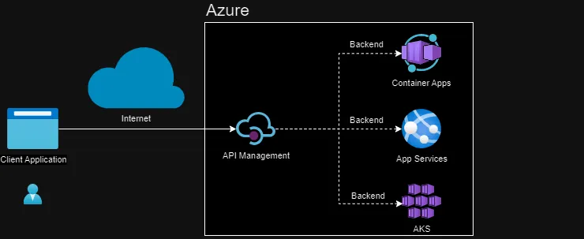

## Problem
If you are in the business of building http APIs in Azure chances are that you may be using Azure API Management and an infrastructure similar to the image below.



You may complicate the above as you like, putting additional services in front of API Management, add API Management to a VNET and expose it via Private Endpoint, etc, but at the end of the day you have an instance of API Management that talks with one or more backend services that implements the exposed APIs.

Adding Azure API Management in front of your services make the deployment phase of the service a tiny bit more complicated since, not only you need to deploy the new service, possibly preventing downtime and making sure you don't break any existing client(s), you also need to reflect your changes to the Azure API Management api, otherwise your changes may not be exposed at all. 
For example let's say that you expose a brand new endpoint in your service but such new endpoint is not part of the API Management API, a client will still get a 404 when trying to invoke such endpoint (Unless you forward everything from API Management to the backend using a catch-all route).

When faced with this problem, I went on the Microsoft Learn [documentation](https://learn.microsoft.com/en-us/azure/api-management/devops-api-development-templates) to look-up the suggested practices to adopt DevOps principles for the management of APIs. 

All the proposed approaches available in the Microsoft Learn documentation requires you to manage the API definition using one of the following ways: 
- ARM Templates
- Terraform resources
- ClickOps + extractor tool 

That's an additional step that you may not be willing to take for a variety of different reasons. I didn't want the burden of managing API definition in git repositories, I jsut needed to update the API to reflect what the underlying service OpenApi documents definition after every service deployment.

## Simple CI/CD for API Management
The solution I was looking for had to satisfy some requirements:
- It had to be **simple**. I valued simplicity above flexibitily
- It shouldn't had any special requirements for authentication (No need to create a service principal)
- It had to be a command line tool so it could be easily integrate it in a GitHub Action workflow.

The deployment workflow that I was envisioning was a simple as:
1) Download artifacts created by the CI workflow/Build the artifacts that needs to be deployed
2) Login to Azure
3) Deploy the artifacts to whicever service I'm using to host the service (App Service/Azure Container Apps/Azure Functions/Azure Kubernetes Service)
4) Update the API in API Management

After some research that yielded no match, I decided to give it a go an build a tool myself.

## Enter Yaat
As the famous sentence goes by, 

*"There are only two hard things in Computer Science: cache invalidation and naming things. -- Phil Karlton"*,

the name I choose prove this (I'm not happy about it, but that was the best I could come up with back then)
Yaat stands for...yes, you guessed it: Yeat another APIM tool
Yaat is a dotnet global tool, it's open source, it's repository can be found [here](https://github.com/ilmax/MaxDon.ApimUpdater) and it's available on nuget. You can install it via the following command:
```bash
dotnet tool install MaxDon.ApimUpdater -g
```

Here's and example on how it can be used in a GitHub action:
```yml
  - name: Az CLI login
    uses: azure/login@v1
    with:
        client-id: ${{ secrets.CLIENT_ID }}
        tenant-id: ${{ secrets.TENANT_ID }}
        subscription-id: ${{ secrets.SUBSCRIPTION_ID }}
        
  - name: Azure WebApp deploy
    uses: azure/webapps-deploy@v2
    with:
        app-name: ${{ inputs.site-name }}
        package: release.zip

  - name: Install Yaat tool
    run: |
        dotnet tool install MaxDon.ApimUpdater -g
        sleep ${{ env.sleep-time }}

  - name: Update API Management API for ${{ inputs.site-name }}
    run: |
        yaat --api-name ${{ inputs.api-name }} --svc https://${{ inputs.site-name }}.azurewebsites.net \
            --spec-url https://${{ inputs.site-name }}.azurewebsites.net/swagger/v1/swagger.json --spec-format openapi-link
```
> The sleep is required if your service startup takes some time, by default yaat also has some built-in retry policy that you can configure via command line

Looking at the parameters here we specify:
- The name of the API we want to update (This is the API in API Management)
- The URL of the service exposing such API
- The URL of the OpenApi specification (swagger json endpoint)
- The type of the specification

If you think some parameters are missing, like for example the API Management instance name, the resource group and so on, that's because yaat tried to implement smart defaults, minimizing the required input parameters, e.g. if it only finds a single API Management instance in the current subscription, it picks that one, but you can specify which instance to pick if you have multiple.

The full list of parameters can be retrived invoking the tool with the `-h/--help` argument.

This tool also uses the Azure API Management SDK and Azure.Identity to authenticate calls to the Azure Resource Manager API so, as long as you're logged in with the regular `azure/login` action, you're good to go.

The full documentation of the tool can be found on the git repository linked above.

I hope you find this useful, I've been using yaat succesfully for last year but if you encounter any problem, feel free to open an issue in the repository and I will do my best to answer it in a timely fashion.

Till next time!