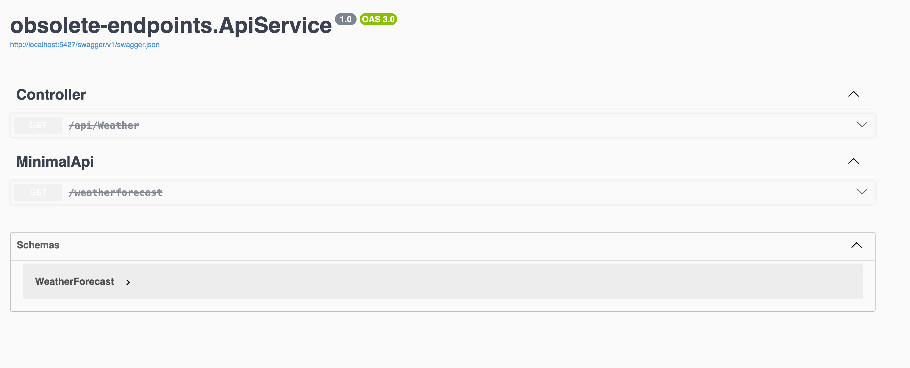
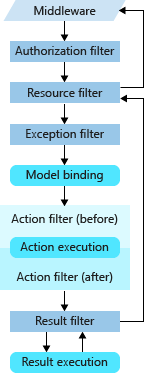
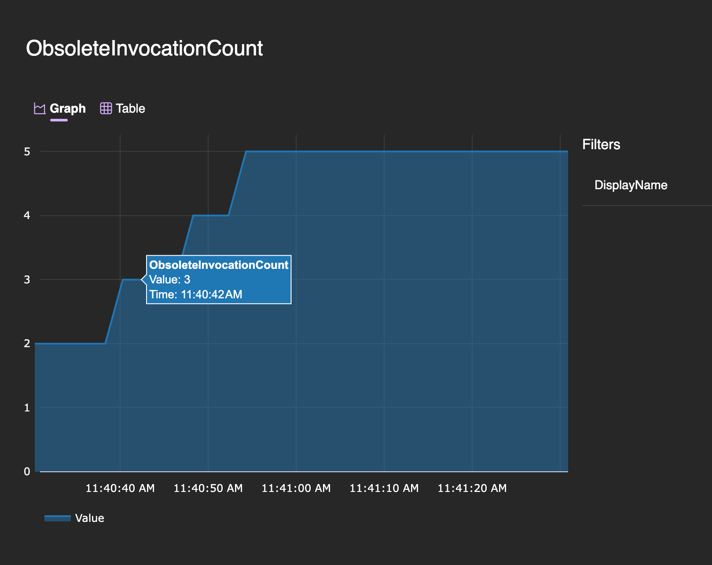



It's common to evolve HTTP APIs, and while it's very easy to expose new and improved versions of a given functionality, not so much to safely obsolete and eventually remove an API.

Have you ever deprecated endpoints and wanted to clean them up after some time? Have you ever deleted obsolete endpoints only to discover, after the deployment that some forgotten service was still using those endpoints? Have you ever needed to track the usage of those obsolete endpoints to plot a nice roadmap toward safe deletion?

If those questions resonate with you, please follow along, I will show you how you can use [OpenTelemetry](https://opentelemetry.io/) to track usage metrics and [Aspire](https://learn.microsoft.com/en-us/dotnet/aspire/get-started/aspire-overview) to visualize those metrics.
As we all know, APIs tend to evolve and managing API versioning is a tricky business. More often than not we need to live with multiple versions of an API just because we are not sure if you can delete the older version of the API and you choose the "better safe than sorry" way of dealing with the problem.

## Marking obsolete endpoints

In ASP.NET Core there's no first-class support for obsoleting endpoints. To do so we can add some metadata to endpoints we want to obsolete and emit some metric every time an endpoint with our newly added metadata executes.

To add metadata to endpoints we use C# attributess. You can implement your custom attribute or, preferably, use the built-in `[ObsoleteAttribute]` that will mark the endpoint as deprecated and will also reflect in the Swagger UI as shown below (*See the grey color and the strikethrough)*:



> Please note that if you use `WithOpenApi()` on a inimal API, it doesn't show the endpoint as obsolete in the UI, refer to the [documentation](https://learn.microsoft.com/en-us/aspnet/core/fundamentals/minimal-apis/openapi?view=aspnetcore-8.0) to correctly setup OpenApi in Minimal API

For controllers, you can add the `[Obsolete]` attribute to either a specific controller action or the entire controller, as shown below:

```csharp
[Tags("Controller")]
[Route("api/[controller]")]
public class WeatherController : ControllerBase
{
    [HttpGet]
    [Obsolete]
    public IActionResult GetWeather()
    {
        return Ok(WeatherGenerator.Generate());
    }
}
```

Adding the attribute at the controller level marks all the controller actions (HTTP APIs) as obsolete while adding to the action marks a single action.

If you're using Minimal API instead, you can achieve the same effect using the following code

```csharp
app.MapGet("/weatherforecast", [Obsolete]() => WeatherGenerator.Generate())
    .WithTags("MinimalApi");
```

> Minimal API is a simplified approach for building HTTP APIs in ASP.NET Core. For more details, refer to the official [documentation](https://learn.microsoft.com/en-us/aspnet/core/fundamentals/minimal-apis/overview?view=aspnetcore-8.0)

Adding the `[Obsolete]` attribute though, is only adding some metadata to the endpoint that will reflect in the OpenApi definition and the Swagger UI, so we need to manually emit some custom telemetry ourselves and follow along to discover how to do it.

## Intercepting endpoint invocations

Once endpoints are marked as obsolete, we need to emit custom telemetry every time our endpoints are invoked. In the MVC world (i.e. when we build our API using controllers) we can implement a filter.

[Filters](https://learn.microsoft.com/en-us/aspnet/core/mvc/controllers/filters?view=aspnetcore-8.0) in MVC are a very powerful way of executing custom code in various stages of the HTTP request pipeline.



*Image courtesy of [https://learn.microsoft.com/en-us/aspnet/core/mvc/controllers/filters?view=aspnetcore-8.0](https://learn.microsoft.com/en-us/aspnet/core/mvc/controllers/filters?view=aspnetcore-8.0)*

As you can see from the image above, the best option is to implement an ActionFilter that runs just before and after our controller action. The code is quite straightforward, we check if our action (the method in the controller that implements the HTTP API) has the obsolete attribute and we emit some telemetry as shown below:

```csharp
public class ObsoleteActionFilter : IAsyncActionFilter
{
    public async Task OnActionExecutionAsync(ActionExecutingContext context, ActionExecutionDelegate next)
    {
        var obsoleteAttribute = context.ActionDescriptor.EndpointMetadata.OfType<ObsoleteAttribute>().FirstOrDefault();
        if (obsoleteAttribute is not null)
        {
            // Emit custom telemetry
            await next();
        }
        else
        {
            await next();    
        }
    }
}
```

For Minimal API we have to implement something similar, but we can't reuse the same code, we have to instead craft a filter specifically for Minimal API like the following:

```csharp
public class ObsoleteEndpointFilter : IEndpointFilter
{
    public async ValueTask<object?> InvokeAsync(EndpointFilterInvocationContext context, EndpointFilterDelegate next)
    {
        var endpoint = context.HttpContext.GetEndpoint();
        if (endpoint is not null)
        {
            var obsolete = endpoint.Metadata.OfType<ObsoleteAttribute>().FirstOrDefault();
            if (obsolete is not null)
            {
                // Emit custom telemetry
                return await next(context);
            }
        }

        return await next(context);
    }
}
```

## Emitting custom telemetry using an ASP.NET Core filter

Now that the skeleton of our filters is done, we have to emit custom telemetry to signal that an obsolete endpoint has been invoked.

OpenTelemetry allows us to emit [metric signals](https://opentelemetry.io/docs/concepts/signals/metrics/), in dotnet to emit custom telemetry we need to create a `Meter` and from it an instrument. In our case, the `Counter<T>` is the most appropriate instrument to record endpoint invocations.
>Showing how to best use OpenTelemetry is outside of the scope of this article, but if you're interested there's a great and very pragmatic [YoutTube video](https://www.youtube.com/watch?v=WzZI_IT6gYo&ab_channel=NDCConferences) on how to do telemetry in dotnet by [Martin Thwaites](https://x.com/MartinDotNet) that can get you up to speed quickly.

Please note that the `Meter` class needs to be a singleton and you should configure OpenTelemetry to listen to the specific meter using the same name to get telemetry emitted. Don't worry if this sounds a bit convoluted now, especially if you're not so familiar with how OpenTelemetry works in dotnet. Martin does an excellent job in getting you up to speed quickly and you can all find all the source code for this article in my GitHub repository [here](https://github.com/ilmax/obsolete-endpoints).

So without further ado, here's the OpentTelementry code:

```csharp
// Service level configuration
public static class DiagnosticConfig
{
    private const string ServiceName = "ObsoleteEndpointsService";
    public static readonly Meter Meter = new(ServiceName);
    public static readonly Counter<long> ObsoleteEndpointCounter = Meter.CreateCounter<long>("ObsoleteInvocationCount");
    public static readonly ActivitySource Source = new(ServiceName);
}

// Action Filter (MVC)
public class ObsoleteActionFilter : IAsyncActionFilter
{
    public async Task OnActionExecutionAsync(ActionExecutingContext context, ActionExecutionDelegate next)
    {
        var obsoleteAttribute = context.ActionDescriptor.EndpointMetadata.OfType<ObsoleteAttribute>().FirstOrDefault();
        if (obsoleteAttribute is not null)
        {
            // Emit custom trace
            using var activity = DiagnosticConfig.Source.StartActivity(DiagnosticNames.ObsoleteEndpointInvocation);
            activity.EnrichWithActionContext(context);

            // Emit custom metric
            DiagnosticConfig.ObsoleteEndpointCounter.Add(1, new KeyValuePair<string, object?>(DiagnosticNames.DisplayName, context.ActionDescriptor.DisplayName));
            await next();
        }
        else
        {
            await next();    
        }
    }
}

// Endpoint Filter (Minimal API)
public class ObsoleteEndpointFilter : IEndpointFilter
{
    public async ValueTask<object?> InvokeAsync(EndpointFilterInvocationContext context, EndpointFilterDelegate next)
    {
        var endpoint = context.HttpContext.GetEndpoint();
        if (endpoint is not null)
        {
            var obsolete = endpoint.Metadata.OfType<ObsoleteAttribute>().FirstOrDefault();
            if (obsolete is not null)
            {
                // Emit custom trace
                using var activity = DiagnosticConfig.Source.StartActivity(DiagnosticNames.ObsoleteEndpointInvocation);
                activity.EnrichWithEndpoint(endpoint, context.HttpContext);

                // Emit custom metric
                DiagnosticConfig.ObsoleteEndpointCounter.Add(1, new KeyValuePair<string, object?>(DiagnosticNames.DisplayName, endpoint.DisplayName));
                return await next(context);
            }
        }

        return await next(context);
    }
}
```

## Registering the filter

Now that we created the filter(s), we need to make sure ASP.NET Core executes our filters during the HTTP Require pipeline, we achieve this by registering the filter(s). MVC and Minimal API have two different ways of registering a filter, in MVC you can do it in several ways, but if you want to apply the filter globally (so that it runs for every HTTP request), you can do the following:

```csharp
builder.Services.AddControllers(opt =>
{
    opt.Filters.Add<ObsoleteActionFilter>();
});
```

Whilst in Minimal API there's no easy way to register a global endpoint filter so in my case I'm adding it to the single endpoint in this way:

```csharp
app.MapGet("/weatherforecast", [Obsolete]() => WeatherGenerator.Generate())
    .AddEndpointFilter<ObsoleteEndpointFilter>() // <-- Filter added here
    .WithTags("MinimalApi");
```

there are some clever tricks you can do to register a filter globally, [Khalid Abuhakmeh](https://github.com/khalidabuhakmeh) has written a nice post about it, you if you're interested you can find more [here](https://khalidabuhakmeh.com/global-endpoint-filters-with-aspnet-core-minimal-apis)

## Visualize the telemetry in the Aspire Dashboard

Our custom metrics telemetry gets exported to the Aspire Dashboard via the OLTP protocol and then shown as follows:


As you can see I'm not adding many additional tags here, I'm just adding the display name that ASP.NET Core computes for the action/endpoint. This should be enough information to identify the called endpoint, but maybe you need some more information about the caller, to accomplish this I decided to also emit a custom span that I then enrich with the `ActionExecutingContext`/`EndpointFilterInvocationContext` with the following code:

```csharp
public static class ActivityExtensions
{
    public static void EnrichWithEndpoint(this Activity? activity, Endpoint endpoint, HttpContext httpContext)
    {
        activity?.SetTag(DiagnosticNames.Url, httpContext.Request.GetDisplayUrl());
        activity?.SetTag(DiagnosticNames.DisplayName, endpoint.DisplayName);
    }
    
    public static void EnrichWithActionContext(this Activity? activity, ActionExecutingContext context)
    {
        activity?.SetTag(DiagnosticNames.Url, context.HttpContext.Request.GetDisplayUrl());
        activity?.SetTag(DiagnosticNames.DisplayName, context.ActionDescriptor.DisplayName);
    }
}
```

This allows you to add all additional information your analysis will require.
>Please make sure that's quite easy to discose sensitive data in your APM of choice so beware of what tags you're adding to the span.

This is how the span will show in Aspire:


Aspire, as of now (June 2024) is mostly a development time tool that allows you to quickly coordinate and run a distributed application.

The Aspire Dashboard is a standalone service that *can* potentially be deployed in production but, as of now, it only provides in-memory storage of telemetry and there's no option to plug in a persistent storage mechanism.

In a production environment, you should probably rely on an industry-standard like [Prometheus](https://prometheus.io/) & [Grafana](https://grafana.com/) to collect and visualize your metrics.

## References

- [https://www.youtube.com/watch?v=WzZI_IT6gYo&ab_channel=NDCConferences](https://www.youtube.com/watch?v=WzZI_IT6gYo&ab_channel=NDCConferences)
- [https://khalidabuhakmeh.com/global-endpoint-filters-with-aspnet-core-minimal-apis](https://khalidabuhakmeh.com/global-endpoint-filters-with-aspnet-core-minimal-apis)
- [https://opentelemetry.io/docs/getting-started/dev/](https://opentelemetry.io/docs/getting-started/dev/)
- [https://learn.microsoft.com/en-us/dotnet/aspire/get-started/aspire-overview](https://learn.microsoft.com/en-us/dotnet/aspire/get-started/aspire-overview)

## Conclusions

In this post, we went through several steps, from implementing controller/endpoint filters to emitting custom telemetry, we looked at how the telemetry will be visualized in the Aspire Dashboard. Those custom telemetry will allow us to inspect which and how often our deprecated API are being used which in turn allows us to make an informed decision and minimize the risk of involuntarily breaking clients.

I hope you found this article helpful, that's all for today till the next time!
